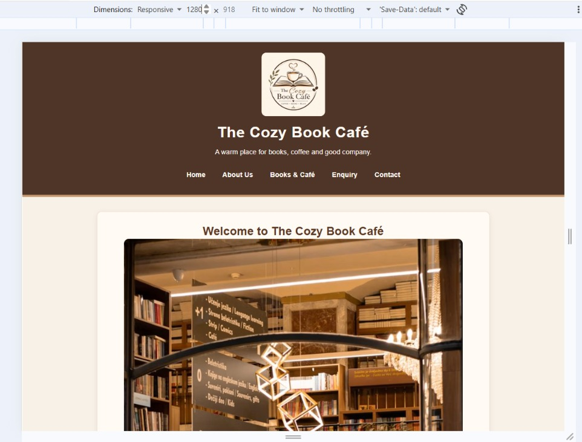
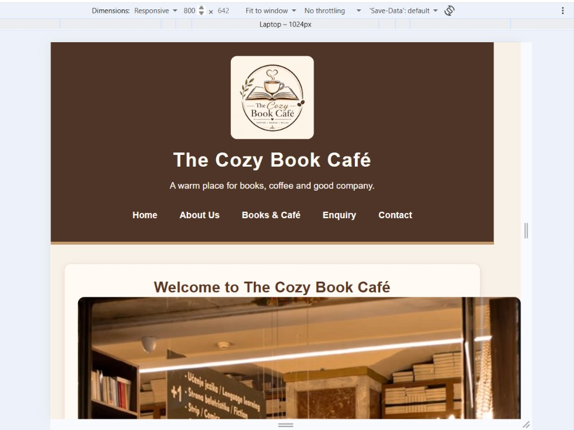
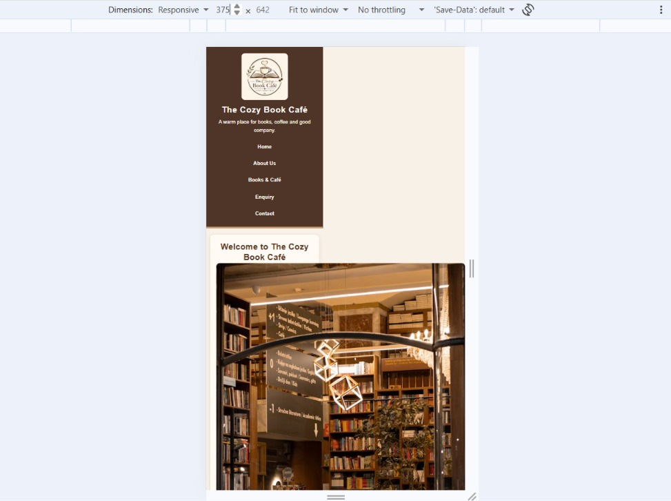

# WEDE5020 POE PART 2

**ST10516589 MOLOTO TSHITSHILA TAMIA**

# The Cozy Book Café

## 1. Project Overview

The Cozy Book Café is a multi-page website created for the WEDE5020 Web Development (Introduction) project. The website represents a welcoming café where customers can enjoy books, coffee, light meals, and a comfortable reading environment.

The website is designed to be simple, user-friendly, responsive, and easy to navigate.

## 2. Goals and Objectives

- Introduce visitors to The Cozy Book Café and its services.
- Provide information about the café and its story.
- Display available books and café products.
- Show the café menu and prices.
- Allow visitors to submit an enquiry.
- Make contact and location information easy to find.
- Create a warm and welcoming online experience.
- Use responsive CSS so the website can be viewed on desktop, tablet, and mobile devices.

## 3. Current Analysis

The current Part 1 website is a five-page static HTML website consisting of Home, About Us, Books & Café/Products, Enquiry, and Contact pages. The pages contain relevant content, images, navigation links, forms, and semantic HTML elements.

### Current strengths

- The website has five connected pages.
- Semantic HTML elements such as `<header>`, `<nav>`, `<main>`, `<section>`, and `<footer>` are used.
- Images include alternative text.
- The Products page contains a structured book table and café menu.
- The Enquiry page contains required form fields.
- Navigation links are available across the website.
- Project documentation includes a README, sitemap, wireframes, proposals, budget, technical requirements, and changelog.

### Current weaknesses and improvements

- The Part 1 website needed a more consistent visual design.
- The pages needed improved spacing, typography, colours, and visual hierarchy.
- Navigation needed clearer hover and focus states.
- The Products table and Enquiry form needed professional styling.
- The layout needed to work well on smaller screens.
- An external CSS stylesheet was needed for Part 2.
- The Contact page needed clearer location information, including maps for the two branches.

## 4. Proposed Features and Functionality

The website includes or plans the following features:

- Home page with a welcome message and call-to-action.
- About Us page with the café story, mission, vision, and team information.
- Products page with books, food, drinks, descriptions, prices, and availability.
- Enquiry page with a customer enquiry form.
- Contact page with contact details, opening hours, branch information, and two maps.
- Navigation menu connecting all five pages.
- Book and café images with alternative text.
- External CSS stylesheet.
- Responsive layouts for different screen sizes.
- Styled tables, forms, links, buttons, sections, and cards.
- Hover and keyboard focus states.
- JavaScript planned for interactive functionality such as form validation in a later development stage.

## 5. Target Audience

- Book lovers
- Students
- Coffee lovers
- Families
- People looking for a quiet place to read or relax
- People interested in reading and socialising

## 6. Design Aesthetic

The selected design concept is **Cozy Book Café - Classic & Comfortable**.

The design uses:

- A warm and cosy café appearance.
- Cream, brown, and soft beige tones.
- Readable typography and clear heading hierarchy.
- Rounded cards and subtle shadows.
- Book and coffee-themed imagery.
- Comfortable spacing and uncluttered layouts.
- Responsive layouts for desktop, tablet, and mobile devices.
- Consistent styling across the website.

## 7. Website Pages

### Home - `index.html`

Introduces The Cozy Book Café with a welcome message, navigation, café imagery, information about what the café offers, and a call-to-action.

### About Us - `about.html`

Provides information about the café, including its story, mission, vision, and team.

### Products - `products.html`

Displays books in an organised table and provides the café menu with food, drinks, descriptions, prices, and availability information.

### Enquiry - `enquiry.html`

Provides a form that visitors can use to make an enquiry about the café, books, food, or services.

### Contact - `contact.html`

Provides contact details, opening hours, branch information, and two embedded maps for the Rosebank and Sandton locations.

## 8. Technologies and Technical Requirements

### Web Technologies

- **HTML5** - used for website structure and content.
- **CSS3** - used for styling, layout, typography, colours, and responsive design.
- **JavaScript** - planned for interactive functionality such as form validation and user feedback.
- **Google Maps** - used for embedded location maps on the Contact page.
- **GitHub** - used for version control and project submission.
- **Visual Studio Code** - used to develop and edit the website.

### CSS Requirements

The external stylesheet `css_assets/style.css` provides:

- Consistent colours and typography.
- Header and footer styling.
- Navigation styling.
- Hover and keyboard focus states.
- Section and card layouts.
- Table styling.
- Form styling.
- Responsive layouts using CSS Grid and Flexbox.
- Media queries for smaller screens.
- Responsive styling for the two Contact page maps.

### JavaScript Requirements

JavaScript is included in the technical plan for interactive functionality. Possible uses include:

- Form validation on the Enquiry page.
- Checking that required fields have been completed.
- Displaying feedback messages after user actions.
- Interactive buttons and other dynamic website features.

The current Part 2 focus is HTML and CSS; JavaScript functionality can be expanded in a later development stage.

### Hardware Requirements

- Desktop or laptop computer.
- Keyboard and mouse/touchpad.
- Internet connection for GitHub access and online resources.

### Software Requirements

- Visual Studio Code or another HTML/CSS editor.
- Modern web browser such as Google Chrome, Microsoft Edge, or Mozilla Firefox.
- Git and GitHub for version control and submission.

### Quality and Accessibility Requirements

- Use semantic HTML5 elements.
- Include a viewport meta tag on every page.
- Use descriptive `alt` text for meaningful images.
- Use labels for form controls.
- Provide visible hover and focus states.
- Use readable font sizes and adequate spacing.
- Keep colour contrast readable.
- Use relative paths for local files.
- Test navigation links and form controls before submission.

## 9. Responsive Design Evidence

The Part 2 requirements call for screenshot evidence at desktop, tablet and mobile sizes. The website was tested using browser developer tools at the following viewport widths, confirming the navigation, layout and typography adapt correctly at each size.

**Desktop (1280px):**


**Tablet (800px):**


**Mobile (375px):**


The responsive implementation uses CSS media queries, relative units (`%`, `rem`, and `em`), CSS Grid/Flexbox, and responsive images using `srcset` and `sizes`.

## 10. Wireframes

The wireframes describe the planned structure of all five website pages.

### Home Page

```text
HEADER / LOGO / NAVIGATION
------------------------------------------------
WELCOME TO THE COZY BOOK CAFÉ
[ Café Interior Image ]
Welcome information and café description
------------------------------------------------
WHAT WE OFFER
[Books] [Coffee] [Light Meals] [Reading] [Events]
------------------------------------------------
VISIT US
[Explore Books & Café]
------------------------------------------------
FOOTER
```

### About Us Page

```text
HEADER / LOGO / NAVIGATION
------------------------------------------------
ABOUT THE CAFÉ
[Our Story]       [Our Mission]
[Our Vision]      [Our Team]
------------------------------------------------
FOOTER
```

### Products Page

```text
HEADER / LOGO / NAVIGATION
------------------------------------------------
OUR BOOKS
[ Books Image ]
------------------------------------------------
FEATURED BOOKS TABLE
Book | Genre | Price | Availability
------------------------------------------------
OUR DRINKS
[ Coffee Image ]
------------------------------------------------
OUR TREATS
[ Cakes Image ]
------------------------------------------------
[MAKE AN ENQUIRY]
------------------------------------------------
FOOTER
```

### Enquiry Page

```text
HEADER / LOGO / NAVIGATION
------------------------------------------------
SEND AN ENQUIRY
Full Name:       [________________]
Email Address:   [________________]
Phone Number:    [________________]
Type of Enquiry: [________________]
Message:         [________________]
[SUBMIT] [CLEAR]
------------------------------------------------
FOOTER
```

### Contact Page

```text
HEADER / LOGO / NAVIGATION
------------------------------------------------
GET IN TOUCH
Email / Phone
------------------------------------------------
OUR LOCATIONS
ROSEBANK BRANCH       SANDTON BRANCH
Address               Address
Phone                 Phone
[Rosebank Map]        [Sandton Map]
------------------------------------------------
OPENING HOURS
------------------------------------------------
[ SEND AN ENQUIRY ]
------------------------------------------------
FOOTER
```

### Responsive Wireframe Plan

On smaller screens:

- Navigation links stack vertically.
- Two-column content changes to one column.
- Images scale to the available screen width.
- The books table can scroll horizontally.
- Form controls use the available screen width.
- The two location maps stack vertically.
- Spacing and heading sizes adjust for readability.

## 10. Two Website Proposals

### Proposal 1: Cozy Book Café - Classic & Comfortable

**Concept:** A warm and welcoming café where customers can enjoy books, coffee, and light meals.

**Main features:**
- Home page with welcome message and café image.
- About Us page.
- Books and café products page.
- Featured books table.
- Enquiry form.
- Contact page with locations and opening hours.
- Responsive external CSS.
- Footer and navigation.
- Hover and focus states.

**Design:** Warm colours, comfortable spacing, readable typography, rounded cards, subtle shadows, and book/coffee imagery.

### Proposal 2: Cozy Book Café - Modern Reading Lounge

**Concept:** A modern reading lounge aimed at students, young adults, and book lovers.

**Main features:**
- Hero section and call-to-action.
- Featured books.
- Drinks and treats sections.
- About Us information.
- Enquiry form.
- Contact and locations page.
- Responsive CSS layout.
- Styled tables, forms, links, and buttons.

**Design:** Modern, minimalist appearance with neutral colours, modern headings, card-style sections, clear navigation, and strong visual hierarchy.

### Selected Proposal

**Proposal 1: Cozy Book Café - Classic & Comfortable** was selected because it matches the cosy reading-café identity and supports the goal of creating a welcoming online experience.

## 11. Budget

| Item | Purpose | Estimated Cost |
|---|---|---:|
| Visual Studio Code | HTML/CSS development | R0 |
| GitHub | Version control and repository | R0 |
| Google Chrome / Edge / Firefox | Browser testing | R0 |
| Canva free resources | Logo/design resources | R0 |
| Unsplash | Free image resources | R0 |
| HTML5/CSS3 | Website technologies | R0 |
| Free static hosting | Optional demonstration hosting | R0 |
| Domain name | Optional professional website address | ±R150/year |
| **Total for academic development** | | **R0** |
| **Optional total with domain** | | **±R150/year** |

## 12. Sitemap

```text
THE COZY BOOK CAFÉ
│
├── HOME - index.html
│   ├── Welcome
│   ├── What We Offer
│   └── Visit Us
│
├── ABOUT US - about.html
│   ├── Our Story
│   ├── Our Mission
│   ├── Our Vision
│   └── Our Team
│
├── PRODUCTS - products.html
│   ├── Our Books
│   ├── Featured Books
│   ├── Our Drinks
│   └── Our Treats
│
├── ENQUIRY - enquiry.html
│   └── Enquiry Form
│
└── CONTACT - contact.html
    ├── Contact Details
    ├── Rosebank Branch
    │   └── Rosebank Map
    ├── Sandton Branch
    │   └── Sandton Map
    └── Opening Hours
```

### Main Navigation

**Home | About Us | Products | Enquiry | Contact**

The navigation menu is available throughout the website.

## 13. File and Folder Structure

```text
Cozy-Book-Cafe/
│
├── index.html
├── about.html
├── products.html
├── enquiry.html
├── contact.html
├── README.md
│
├── _images/
│   ├── logo.png
│   ├── interior.png
│   ├── books.png
│   ├── coffee.png
│   └── cakes.png
│
├── css_assets/
│   └── style.css
│
├── js_assets/
│   └── (reserved for JavaScript development)
│
└── documentation/
    ├── CHANGELOG.md
    ├── PROPOSALS.md
    ├── budget.md
    ├── sitemap.md
    ├── technical_requirements.md
    └── wireframes.md
```

## 14. HTML Structure and Content

The website uses semantic HTML5 elements including:

- `<header>` for page headers and branding.
- `<nav>` for the main navigation.
- `<main>` for the primary page content.
- `<section>` for organised content areas.
- `<article>` where appropriate for independent content.
- `<footer>` for footer information.
- Headings such as `<h1>`, `<h2>`, and `<h3>` to create a clear content hierarchy.
- Paragraphs, lists, tables, images, links, and forms for page content.

The website contains sufficient content to explain the café, books, products, menu, enquiry process, contact details, and locations.

## 15. Navigation and Links

All five main pages are connected through the navigation menu:

**Home | About Us | Products | Enquiry | Contact**

Internal links use the correct local HTML file names. Images and the stylesheet use relative paths within the project folders.

## 16. Comments and Code Organisation

Comments are used in the HTML and CSS where they help explain sections or functionality. The code is organised into separate HTML, CSS, image, JavaScript, and documentation folders to make the project easier to maintain.

## 17. GitHub Version Control

GitHub is used for version control and project submission. Descriptive commits should be used to record meaningful development changes, such as creating pages, adding content, adding CSS, improving responsive design, and updating documentation.

## 18. Timeline and Milestones

| Stage | Task | Milestone |
|---|---|---|
| Week 1 | Project planning and research | Business idea, website goals, and target audience identified |
| Week 2 | Website structure | Folder structure and HTML pages created |
| Week 3 | Homepage development | `index.html` completed |
| Week 4 | Additional pages | About Us, Products, Enquiry, and Contact pages developed |
| Week 5 | Images and content | Café images, book images, menu information, and other content added |
| Week 6 | Testing and improvements | Links, forms, images, and page structure checked |
| Week 7 | Part 2 CSS development | External stylesheet added and pages styled |
| Week 8 | Final improvements | Responsive design and two Contact page maps added |

## 19. Part 2 Development

Part 2 improves the website after the Part 1 feedback.

The following improvements were made:

- Added `css_assets/style.css` as an external stylesheet.
- Linked the stylesheet to all five HTML pages.
- Added a consistent warm café colour palette.
- Improved typography, spacing, and visual hierarchy.
- Styled navigation, links, buttons, sections, tables, and forms.
- Added hover and keyboard focus states.
- Added responsive layouts using CSS Grid and Flexbox.
- Added mobile media queries.
- Added responsive handling for the Featured Books table.
- Added two embedded maps to the Contact page.
- Added a Rosebank location map.
- Added a Sandton location map.

## 20. Changelog

A detailed record of project changes is available in:

`documentation/CHANGELOG.md`

Recent updates include:

- Current website analysis added.
- Website proposals expanded.
- Budget and technical requirements documented.
- Sitemap and wireframes expanded.
- External CSS added for Part 2.
- Responsive styling added.
- Contact page maps added for Rosebank and Sandton.

## 21. Future Improvements

Possible future improvements include:

- Adding JavaScript for interactive features and form validation.
- Adding an online booking system.
- Adding a shopping/cart feature for books.
- Adding customer reviews.
- Connecting the enquiry form to a backend service.
- Adding additional café locations.

## 22. References

Canva (n.d.) *Logo Maker*. Available at: https://www.canva.com/create/logos/ (Accessed: 12 August 2026).

Unsplash (n.d.) *Unsplash*. Available at: https://unsplash.com/ (Accessed: 14 August 2026).

Unsplash (n.d.) *Unsplash License*. Available at: https://unsplash.com/license (Accessed: 14 August 2026).

W3Schools (n.d.) *HTML Tutorial*. Available at: https://www.w3schools.com/html/ (Accessed: 14 August 2026).

W3Schools (n.d.) *HTML Forms*. Available at: https://www.w3schools.com/html/html_forms.asp (Accessed: 14 August 2026).

W3Schools (n.d.) *HTML Images*. Available at: https://www.w3schools.com/html/html_images.asp (Accessed: 14 August 2026).

W3Schools (n.d.) *CSS Tutorial*. Available at: https://www.w3schools.com/css/ (Accessed: 15 September 2026).

W3Schools (n.d.) *CSS Responsive Web Design*. Available at: https://www.w3schools.com/css/css_rwd_intro.asp (Accessed: 15 September 2026).

Google Maps (n.d.) *Google Maps*. Available at: https://www.google.com/maps/ (Accessed: 18 September 2026).

## 23. How to View the Website

1. Open the project folder in Visual Studio Code.
2. Open `index.html`.
3. Run the website in a modern browser or using Live Server.
4. Use the navigation menu to visit the other pages.
5. Open the Contact page to view the Rosebank and Sandton maps.
